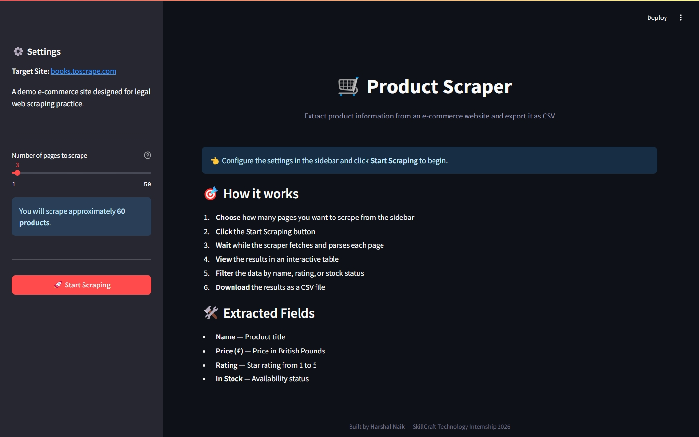
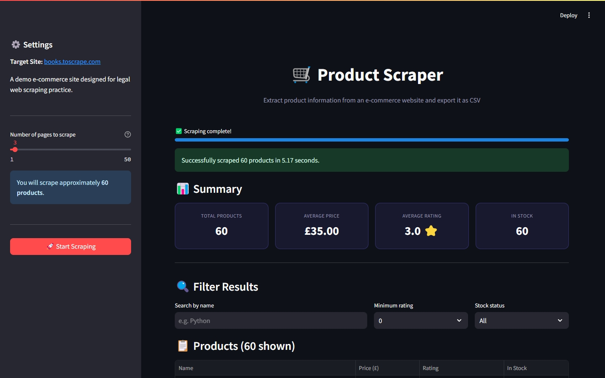

# 🛒 Product Web Scraper

A Python-based web scraper with a Streamlit GUI that extracts product information (name, price, rating, stock) from an e-commerce website and exports it to CSV.

Built as **Task 4** of my Software Development Internship at **SkillCraft Technology** (August 2026).

---

## Features

- Interactive Streamlit GUI
- Configurable number of pages to scrape (1–50)
- Real-time progress bar during scraping
- Extracts product name, price, rating, and stock status
- Live preview of scraped data in a searchable table
- Filter results by name, rating, or stock status
- Summary statistics (total products, average price, average rating, in-stock count)
- Export data as CSV (all data or filtered subset)
- Save CSV files to disk
- Clean separation between scraping logic and UI

---

## Target Website

This project scrapes **[books.toscrape.com](https://books.toscrape.com)** — a website specifically built for legal, ethical web scraping practice. It provides real product data (titles, prices, ratings, availability) without violating any terms of service.

> ⚠️ **Note on ethics:** Real e-commerce sites like Amazon or Flipkart forbid scraping in their Terms of Service and use anti-bot systems. This project intentionally uses a scraping-friendly demo site to demonstrate the technique responsibly.

---

## Tech Stack

| Technology     | Purpose |
|----------------|---------|
| Python         | Core language |
| requests       | HTTP requests |
| BeautifulSoup4 | HTML parsing |
| lxml           | Fast parser backend |
| Streamlit      | Interactive GUI |
| pandas         | Data handling and CSV export |

---

## Project Structure

```
SCT_SD_4/
├── app.py               # Streamlit UI
├── scraper.py           # Scraping logic
├── requirements.txt     # Python dependencies
├── data/                # Saved CSV files
├── assets/
│   └── favicon.png
├── .gitignore
└── README.md
```

---

## How to Run

### Prerequisites

- Python 3.9 or higher
- pip

### Setup

1. Clone this repository:

   ```bash
   git clone https://github.com/harshal0212/SCT_SD_4.git
   cd SCT_SD_4
   ```

2. (Recommended) Create a virtual environment:

   ```bash
   python -m venv venv
   ```

   Activate it:
   - Windows: `venv\Scripts\activate`
   - macOS / Linux: `source venv/bin/activate`

3. Install dependencies:

   ```bash
   pip install -r requirements.txt
   ```

4. Run the Streamlit app:

   ```bash
   streamlit run app.py
   ```

5. Your browser will open at `http://localhost:8501` — start scraping!

---

## How to Use

1. Open the app in your browser
2. Use the sidebar slider to pick how many pages to scrape (1–50)
3. Click **🚀 Start Scraping**
4. Watch the progress bar as pages are fetched
5. Explore the results in the interactive table
6. Use filters to narrow down the data
7. Click **📥 Download CSV** to export

---

## Extracted Fields

| Field    | Type   | Description |
|----------|--------|-------------|
| Name     | String | Product title |
| Price    | Float  | Price in GBP (£) |
| Rating   | Int    | Star rating (1–5) |
| In Stock | String | "Yes" or "No" |

---

## Screenshots

### Desktop View



### Data Table



---

## Running Scraper Standalone (without GUI)

You can also run just the scraper for quick testing:

```bash
python scraper.py
```

This will fetch 1 page and print the first 3 products to the console.

---

## Future Improvements

- Support for multiple target websites
- Scheduled scraping (cron-based)
- Store data in a database (SQLite/PostgreSQL)
- Price change tracking over time
- Export to Excel and JSON formats
- Proxy rotation for scaling
- Detailed product page scraping (descriptions, images)

---

## Author

**Harshal Sambhaji Naik**  
Software Development Intern at SkillCraft Technology  
August 2026

- GitHub: [@harshal0212](https://github.com/harshal0212)
- LinkedIn: [Harshal Naik](https://linkedin.com/in/harshal-naikk)

---

## License

This project is created for educational and internship evaluation purposes.